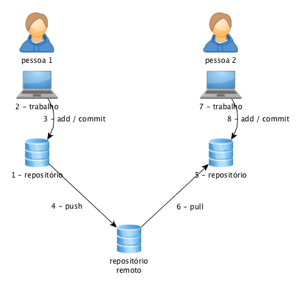

# 🚀Resumo 01 

## Versionamento de Código & Git e GitHub
 - Versionamento de Código nada mais é que atualizações de projetos (Modificações ) para a finalização do mesmo. A cada atualização , temos uma nova versão. fazer versionamento de forma manual se torna muito complexo por causa variaveis que podem causa possiveis problemas. Focando na perspectiva desses problemas foi criado o Git(Sistema de controle de versão Distribuido)que pode Registrar historico de atualizações de arquivos, gerencia alterações, datas , autor e etc. O GitHub nada mais é uma plataforma de hospedagem de código para controle de versão do Git. 

## Fluxo Básico do Git & GitHub

- Então Normalmente Utilizamos Git Clone + URL para clonar repositorios Remoto. Ao clonar fazemos nosso primeiro Commit com Git Commit -m "Meu primeiro Commit". Utilizamos após a atulização Git push para empurrar alterações do Repositorio local para o repositorio Remoto. Quem quiser pegar essas alterações feitas utiliza Git Pull + URL.

|Palavras Chaves|Significado|
|-----|-----|
git clone | Clona um repositorio diretamente do Servidor.
git commit | Grava alterações no Repositorio.
git push | Empurra alterações do Repositorio local para o Remoto.
git pull | Puxa alterações de Repositorio Remoto para p Repositorio local.
